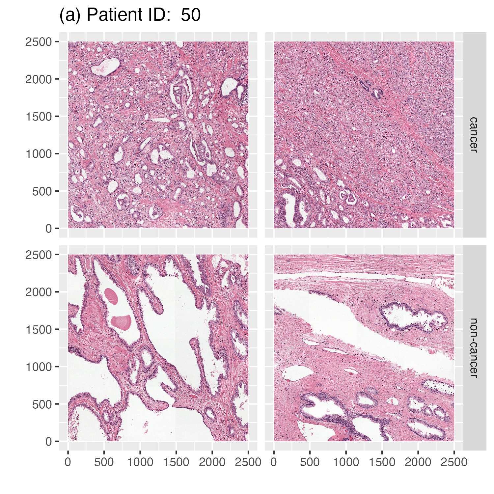
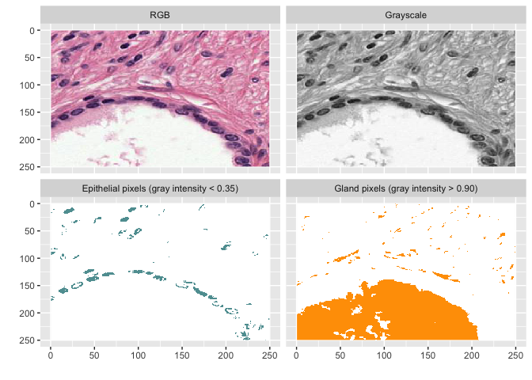
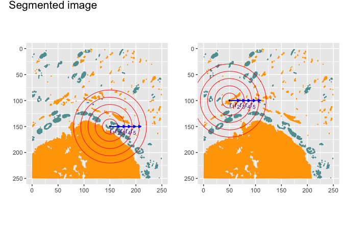
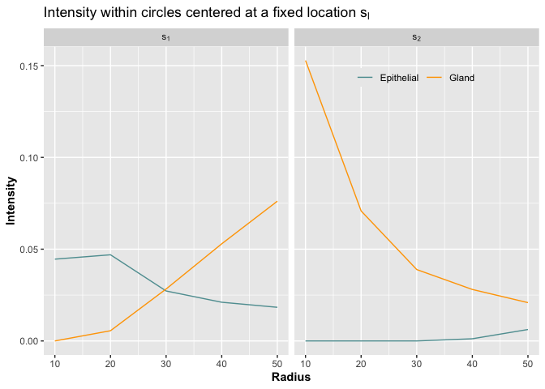
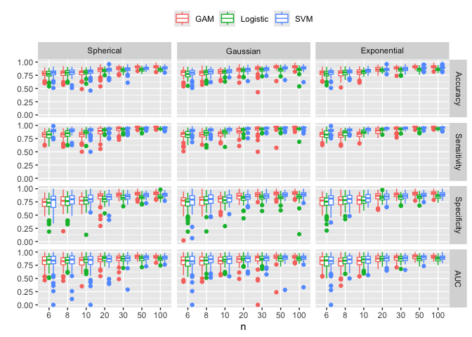
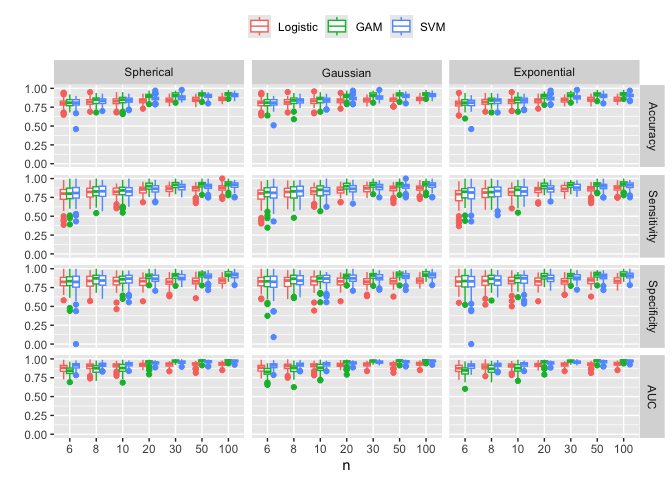
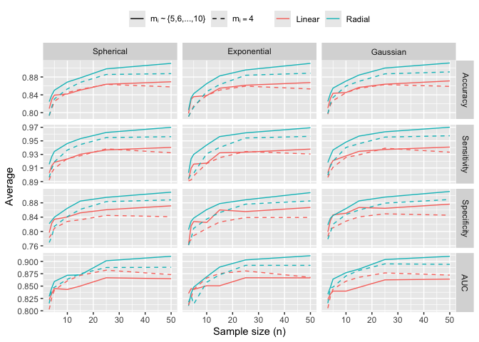

# rSiMFD: an automatic cancer screening on histopathology image using


<script src="README_files/libs/kePrint-0.0.1/kePrint.js"></script>
<link href="README_files/libs/lightable-0.0.1/lightable.css" rel="stylesheet" />

# Introduction

- This block loads all required R packages used throughout the analysis
  and figure generation.

``` r
# Necessary R libraries
library(tidyverse)
library(dplyr)
library(MASS)
library(refund)
library(nlme)
library(boot)
library(parallel)
library(snow)
library(doSNOW)
library(doParallel)
library(foreach)
library(imager)
library(grid)
library(ggpubr)
library(tidyverse)
library(dplyr)
```

- Here we define directory paths used by downstream chunks to read
  simulation outputs and to write figures/tables produced by the
  scripts.

``` r
sim_res_dir<-"SimulationStudy_Results/"
peso_da_res_dir<-"rSiMFD_Paper/PESO_Results/"
```

- We load the PESO test-set mapping, group rows by slide and tissue
  type, and assign a patch index within each slide. The resulting
  `infodat` drives image retrieval and patch-level summaries.

## PESO data analysis

``` r
infodat<-read.csv("Data/peso_testset_mapping.csv") %>%

  group_by(slide,type) %>%
  
  mutate(Patch=row_number())
```

### Exploration of PESO images

- Quick exploratory check: we tabulate the counts of cancer
  vs. non-cancer patches to verify class balance prior to modeling and
  visualization.

<!-- -->


        cancer non-cancer 
            71         89 

## Figure 1

- We select two representative slides and build a long RGB dataframe for
  every pixel of each selected patch. This enables ggplot-based raster
  rendering and faceting by patch and label.

``` r
slideID<-c(50,53)
slide_df<-do.call(rbind,lapply(slideID, function(i){
  patch<-infodat$id[infodat$slide==i]
  
  do.call(rbind,lapply(patch, function(u){
    nc_im1<-imager::load.image(paste("Data/",u,".jpg",sep=""))
  data.frame(x=rep(1:2500,2500),y=rep(2500:1,each=2500),
             Red=as.numeric(R(nc_im1)),
             Green=as.numeric(G(nc_im1)),
             Blue=as.numeric(B(nc_im1)),
             Slide=paste("Patient ID: ",i),
             Patch=infodat$Patch[u],
             Type=infodat$type[u]) 
  }))
}))
```

- We render all patches from the first selected slide as raster images,
  faceted by patch and type, and save the panel as
  `Figures/Figure1a.jpg`.

``` r
df50<-slide_df %>%
  filter(Slide==unique(slide_df$Slide)[1])

img_plot50<-df50 %>%
  ggplot(aes(x = x, y =y))+                   #plot map
  geom_raster(fill = rgb(r = df50$Red,
                         g = df50$Green,
                         b = df50$Blue,
                         maxColorValue = 1)) +
  facet_grid(cols=vars(Patch),rows = vars(Type))+
  xlab(" ") +
  ylab(" ") +
  theme(strip.text.x = element_blank()) +
  ggtitle(paste("(a)",unique(slide_df$Slide)[1]))
ggsave(plot = img_plot50,filename = "Figures/Figure1a.jpg",height = 5,width = 5,dpi = 300)
```

- We render all patches from the second selected slide in the same
  format and save as `Figures/Figure1b.jpg`.

``` r
df53<-slide_df %>%
  filter(Slide==unique(slide_df$Slide)[2])

img_plot53<-df53 %>%
  ggplot(aes(x = x, y =y))+                   #plot map
  geom_raster(fill = rgb(r = df53$Red,
                         g = df53$Green,
                         b = df53$Blue,
                         maxColorValue = 1)) +
  facet_grid(cols=vars(Patch),rows = vars(Type))+
  xlab(" ") +
  ylab(" ") +
  theme(strip.text.x = element_blank()) +
  ggtitle(paste("(b)",unique(slide_df$Slide)[2]))
ggsave(plot = img_plot53,filename = "Figures/Figure1b.jpg",height = 5,width = 5,dpi = 300)
```

Displayed below are the saved panels from the previous two chunks
(Figure 1a and Figure 1b), illustrating examples of non-cancer
vs. cancer patches from two subjects.



 \## Image to SiMFD

- We load a single image patch, convert it to grayscale, and extract a
  smaller sub-region to keep visuals compact. We then assemble a tidy
  frame that contains RGB and grayscale values and derive simple pixel
  masks highlighting epithelial (low gray intensity) and gland (high
  gray intensity) regions.

``` r
img<-load.image("Data/105.jpg")
gimg<-grayscale(img)
patch_im<-imsub(img,x>600&x<850,y>750&y<1000)
patch_gim<-imsub(gimg,x>600&x<850,y>750&y<1000)
im_dat1<-as.data.frame(patch_im,wide="c")%>%
  mutate(rgb_val=rgb(c.1,c.2,c.3),
         Gvalue=as.data.frame(patch_gim)$value,
         gray_val=gray(Gvalue),
         Epcell=ifelse(Gvalue<0.35,"#5F9EA0","#FFFFFF"),
         Gcell=ifelse(Gvalue>0.90,"#ff9f00","#FFFFFF"),
         EGcell=ifelse(Gvalue<0.35,"#5F9EA0",ifelse(Gvalue>0.90,"#ff9f00","#FFFFFF"))) %>%
  pivot_longer(c("rgb_val","gray_val","Epcell","Gcell","EGcell"),names_to = "Type",values_to = "RGBcolor") %>%
  mutate(Type=factor(recode(Type,
                            "rgb_val"="RGB",
                            "gray_val"="Grayscale",
                            "Epcell"="Epithelial pixels (gray intensity < 0.35)",
                            "Gcell"="Gland pixels (gray intensity > 0.90)",
                            "EGcell"="Epithelial and Gland"),levels=c("RGB","Grayscale","Epithelial pixels (gray intensity < 0.35)","Gland pixels (gray intensity > 0.90)","Epithelial and Gland")))
```

- We visualize the sub-region in multiple representations—RGB,
  grayscale, epithelial mask, and gland mask—using `geom_raster` and
  save the multi-panel output as `Figures/Figure2.pdf`.

``` r
im_dat1 %>%
  subset(Type!="Epithelial and Gland") %>%
  ggplot(aes(x,y))+
  geom_raster(aes(fill=RGBcolor))+
  scale_fill_identity()+
  scale_y_reverse()+
  facet_wrap(vars(Type),ncol = 2) +
  xlab("") +
  ylab("") 
```



``` r
ggsave("Figures/Figure2.jpg",height=8,width = 8,dpi = 300)
```

- For subsequent geometric summaries, we rebuild a compact color/gray
  dataframe and keep convenient columns for the epithelial and gland
  masks. This object is an intermediate used to construct class-specific
  point clouds.

``` r
col_dat<-as.data.frame(patch_im,wide="c")%>%
  mutate(rgb_val=rgb(c.1,c.2,c.3),
         Gvalue=as.data.frame(patch_gim)$value,
         gray_val=gray(Gvalue),
         Epcell=ifelse(Gvalue<0.35,"#5F9EA0","#FFFFFF"),
         Gcell=ifelse(Gvalue>0.90,"#ff9f00","#FFFFFF"),
         EGcell=ifelse(Gvalue<0.35,"#5F9EA0",ifelse(Gvalue>0.90,"#ff9f00","#FFFFFF")))
```

- We create epithelial (`Edat`) and gland (`Gdat`) point clouds by
  thresholding grayscale intensity. For each point, we compute distances
  to two reference centers and generate ring indicator variables at
  multiple radii; these are used to summarize intensity within expanding
  circles.

``` r
Edat<- col_dat %>%
  filter(Gvalue<0.35) %>%
  set_names(c("Row","Col","Red","Green","Blue","rgb_val","Gvalue","gray_val", "Epcell","Gcell","EGcell")) %>%
  mutate(Type="Epithelial",
         ds1=sqrt((Row-150)^2+(Col-150)^2),
         ds2=sqrt((Row-50)^2+(Col-100)^2)) %>%
  mutate(ds1r1=as.numeric(ds1<=5),
         ds1r2=as.numeric(ds1<=10),
         ds1r3=as.numeric(ds1<=15),
         ds1r4=as.numeric(ds1<=20),
         ds1r5=as.numeric(ds1<=25),
         ds2r1=as.numeric(ds2<=5),
         ds2r2=as.numeric(ds2<=10),
         ds2r3=as.numeric(ds2<=15),
         ds2r4=as.numeric(ds2<=20),
         ds2r5=as.numeric(ds2<=25))
Gdat<-col_dat %>%
  filter(Gvalue>0.90) %>%
  set_names(c("Row","Col","Red","Green","Blue","rgb_val","Gvalue","gray_val", "Epcell","Gcell","EGcell"))%>%
  mutate(Type="Gland",
         ds1=sqrt((Row-150)^2+(Col-150)^2),
         ds2=sqrt((Row-50)^2+(Col-100)^2)) %>%
  mutate(ds1r1=as.numeric(ds1<=5),
         ds1r2=as.numeric(ds1<=10),
         ds1r3=as.numeric(ds1<=15),
         ds1r4=as.numeric(ds1<=20),
         ds1r5=as.numeric(ds1<=25),
         ds2r1=as.numeric(ds2<=5),
         ds2r2=as.numeric(ds2<=10),
         ds2r3=as.numeric(ds2<=15),
         ds2r4=as.numeric(ds2<=20),
         ds2r5=as.numeric(ds2<=25))
```

- (Panel $S_1$) Using the epithelial and gland point clouds, we plot the
  sub-region with overlaid concentric rings centered at the first
  reference location. Annotations label the ring radii for clarity.

``` r
l<-seq(10,50,10)
sloc1<-Edat %>%
  add_case(Gdat) %>%
  ggplot(aes(x=Row,y=Col,col=Type)) +
  geom_point(size=0.05) +
  scale_y_reverse() +
  scale_color_manual(values = c("cadetblue","orange"),c("Epithelial","Gland")) +
  annotate('point',x=150, y=150, size=1, shape=20, color="black") +
  annotate('point',x=150, y=150, size=l, shape=1, color="red")+
  annotate('text',x=145+seq(10,50,10), y=160,label=c("paste(r[1])","paste(r[2])","paste(r[3])","paste(r[4])","paste(r[5])"),parse=TRUE,color="purple4")+
  annotate("segment", x = 150, y = 150, xend =160+seq(10,50,10), yend = 150,
         arrow = arrow(type = "closed", length = unit(0.02, "npc")),color="blue") +
  coord_equal(ratio = 1)+
  theme(legend.box = element_blank(),legend.position = "none") +
  xlab("") +
  ylab("")
```

- (Panel $S_2$) We repeat the ring overlay centered at the second
  reference location to illustrate how summaries vary with the choice of
  center.

``` r
l<-seq(10,50,10)

sloc2<-Edat %>%
  add_case(Gdat) %>%
  ggplot(aes(x=Row,y=Col,col=Type)) +
  geom_point(size=0.05) +
  scale_y_reverse() +
  scale_color_manual(values = c("cadetblue","orange"),c("Epithelial","Gland")) +
  annotate('point',x=50, y=100, size=1, shape=20, color="black") +
  annotate('point',x=50, y=100, size=l, shape=1, color="red")+
  annotate('text',x=45+seq(10,50,10), y=110,label=c("paste(r[1])","paste(r[2])","paste(r[3])","paste(r[4])","paste(r[5])"),parse=TRUE,color="purple4")+
  annotate("segment", x = 50, y = 100, xend =60+seq(10,50,10), yend = 100,
         arrow = arrow(type = "closed", length = unit(0.02, "npc")),color="blue") +
  coord_equal(ratio = 1)+
  theme(legend.box = element_blank(),legend.position = "none") +
  xlab("") +
  ylab("")
```

- We combine the two annotated panels into a single figure titled
  “Segmented image” and save it as `Figures/simfd_sloc.pdf`.

``` r
seg_image<-ggarrange(sloc1,sloc2,ncol = 2)

annotate_figure(seg_image,fig.lab = "Segmented image",fig.lab.pos = "top.left",fig.lab.size = 16)
```



``` r
ggsave(file="Figures/simfd_sloc.pdf",height=5,width = 8)
```

- (Alternative base R version) We reproduce the segmented-image
  visualization using base graphics—useful for environments without
  ggplot dependencies—and write the result to `Figures/simfd_sloc.pdf`.

``` r
pdf("Figures/simfd_sloc.pdf",height = 4,width = 8)
par(mfrow=c(1,2),mai = c(0.5, 0.5, 0.5, 0.5))
plot.new()
plot.window(xlim=c(0,250),ylim=rev(c(0,250)))
axis(1,at=seq(0,250,50),labels = seq(0,250,50))
axis(2,at=seq(0,250,50),labels = seq(0,250,50))
box()
grid(nx = 10,ny=10)
points(Edat$Row,Edat$Col,col="cadetblue",pch=20,cex=0.05)
points(Gdat$Row,Gdat$Col,col="orange",pch=20,cex=0.05)
points(150,150,pch=20,col="blue",cex=1.2)
for(i in 1:length(l)){
  circles(150,150,l[i],fg="red",lwd=2)
  arrows(150,150,150+l[i],150,length = 0.05)
  text(150+l[i]-5,160,labels=bquote(r[.(i)]),cex=0.7)
  text(150-5,150,labels=bquote(s[1]),cex=0.7)
}
title("Segmented image",adj=0)

plot.new()
plot.window(xlim=c(0,250),ylim=rev(c(0,250)))
axis(1,at=seq(0,250,50),labels = seq(0,250,50))
axis(2,at=seq(0,250,50),labels = seq(0,250,50))
box()
grid(nx = 10,ny=10)
points(Edat$Row,Edat$Col,col="cadetblue",pch=20,cex=0.05)
points(Gdat$Row,Gdat$Col,col="orange",pch=20,cex=0.05)
points(50,100,pch=20,col="blue",cex=1.2)
for(i in 1:length(l)){
  circles(50,100,l[i],fg="red",lwd=2)
  arrows(50,100,50+l[i],100,length = 0.05)
  text(50+l[i]-5,110,labels=bquote(r[.(i)]),cex=0.7)
  text(50-5,100,labels=bquote(s[2]),cex=0.7)
}

dev.off()
```

    quartz_off_screen 
                    2 

- We construct `qefun`, which aggregates ring-level counts within each
  radius for epithelial and gland classes around both centers. These
  aggregates drive normalized intensity functions ( Q(r) ) for
  comparative plots.

``` r
qefun<-data.frame(Qfun=c(as.numeric(colSums(Edat[,c("ds1r1","ds1r2","ds1r3","ds1r4","ds1r5")])),as.numeric(colSums(Gdat[,c("ds1r1","ds1r2","ds1r3","ds1r4","ds1r5")])),as.numeric(colSums(Edat[,c("ds2r1","ds2r2","ds2r3","ds2r4","ds2r5")])),as.numeric(colSums(Gdat[,c("ds2r1","ds2r2","ds2r3","ds2r4","ds2r5")]))),
                  Type=rep(c("Epithelial","Gland","Epithelial","Gland"),each=5),
                  Sloc=rep(c("s[1]","s[2]"),each=10),
                  Radius=rep(l,times=4))
```

- We plot normalized intensity ( Q(r) ) versus radius for epithelial
  vs. gland classes at each center, facet by center, and save the
  derived function plot as `Figures/derived_simfd.pdf`.

``` r
qefun %>%
  mutate(Qval=Qfun/(pi*Radius^2)) %>%
  ggplot(aes(Radius,Qval,group=Type,col=Type)) +
  geom_line() +
  facet_grid(cols=vars(Sloc),labeller = label_parsed) +
  scale_color_manual(values=c("cadetblue","orange"),labels=c("Epithelial","Gland")) +
  theme(legend.position = c(0.75,0.9),legend.background = element_rect(fil="transparent"),legend.title = element_blank(),legend.direction = "horizontal",title = element_text(face="bold")) +
  ggtitle(expression("Intensity within circles centered at a fixed location "*s[l]))+
  xlab("Radius") +
  ylab("Intensity")
```



``` r
ggsave("Figures/derived_simfd.pdf",height = 4,width = 8)

# expression(Q[ij](bold(s)*";"*r))
```

- To summarize spatial patterns more broadly, we define a grid of
  centers over the image and compute class-specific cumulative ring
  counts (normalized) around each grid point. The resulting matrices
  (`EFun`, `GFun`) contain families of ( Q(r) ) curves across locations.

``` r
ss<-expand.grid(seq(25,250,50),seq(25,250,50))
sz<-25
l<-seq(5,25,5)
cord_dat<-im_dat1 %>%
  filter(Type=="Epithelial and Gland") %>%
  filter(RGBcolor!="#FFFFFF") %>%
  dplyr::select(x,y,Gvalue) 

EFun<-apply(ss,1,function(v){
  w<-as.numeric(v)
  a1<-as.numeric(w[1]+25); a2<-as.numeric(w[1]-25)
  b1<-as.numeric(w[2]+25); b2<-as.numeric(w[2]-25)
  temp_dat<-cord_dat %>%
    filter(x<=a1 & x>=a2) %>%
    filter(y<=b1 & y>=b2) %>%
    filter(Gvalue<0.35)
  as.numeric(cumsum(table(cut(sqrt(rowSums((outer(rep(1,nrow(temp_dat)),w)-temp_dat[,1:2])^2)),seq(0,25,5)))))*(1/(pi*seq(5,25,5)^2))
})
GFun<-apply(ss,1,function(v){
  w<-as.numeric(v)
  a1<-as.numeric(w[1]+25); a2<-as.numeric(w[1]-25)
  b1<-as.numeric(w[2]+25); b2<-as.numeric(w[2]-25)
  temp_dat<-cord_dat %>%
    filter(x<=a1 & x>=a2) %>%
    filter(y<=b1 & y>=b2) %>%
    filter(Gvalue>0.90)
  as.numeric(cumsum(table(cut(sqrt(rowSums((outer(rep(1,nrow(temp_dat)),w)-temp_dat[,1:2])^2)),seq(0,25,5)))))*(1/(pi*seq(5,25,5)^2))
})
```

## Figure 3

- (Figure 3) We assemble a multi-panel figure: (i) segmented image with
  rings at ( s_1 ), (ii) segmented image with rings at ( s_2 ), (iii)
  grid of centers with rings, and (iv–vi) the corresponding ( Q(r) )
  function summaries. The figure is written to `Figures/Figure3.pdf`.

``` r
pdf("Figures/Figure3.pdf",width=8,height=4)
par(mfrow=c(2,3),mai = c(0.35, 0.35, 0.35, 0.35))
plot.new()
plot.window(xlim=c(0,250),ylim=rev(c(0,250)))
axis(1,at=seq(0,250,50),labels = seq(0,250,50))
axis(2,at=seq(0,250,50),labels = seq(0,250,50))
box()
grid(nx = 10,ny=10)
points(Edat$Row,Edat$Col,col="cadetblue",pch=20,cex=0.05)
points(Gdat$Row,Gdat$Col,col="orange",pch=20,cex=0.05)
points(150,150,pch=20,col="blue",cex=1.2)
for(i in 1:length(l)){
  circles(150,150,l[i],fg="black",lwd=2)
  arrows(150,150,150+l[i],150,length = 0.05)
  text(150+l[i]-5,160,labels=bquote(r[.(i)]),cex=0.7)
  text(150-5,150,labels=bquote(s[1]),cex=0.7)
}


plot.new()
plot.window(xlim=c(0,250),ylim=rev(c(0,250)))
axis(1,at=seq(0,250,50),labels = seq(0,250,50))
axis(2,at=seq(0,250,50),labels = seq(0,250,50))
box()
grid(nx = 10,ny=10)
points(Edat$Row,Edat$Col,col="cadetblue",pch=20,cex=0.05)
points(Gdat$Row,Gdat$Col,col="orange",pch=20,cex=0.05)
points(50,100,pch=20,col="blue",cex=1.2)
for(i in 1:length(l)){
  circles(50,100,l[i],fg="black",lwd=2)
  arrows(50,100,50+l[i],100,length = 0.05)
  text(50+l[i]-5,110,labels=bquote(r[.(i)]),cex=0.7)
  text(50-5,100,labels=bquote(s[2]),cex=0.7)
}

plot.new()
plot.window(xlim=c(0,250),ylim=rev(c(0,250)))
axis(1,at=seq(0,250,50),labels = seq(0,250,50))
axis(2,at=seq(0,250,50),labels = seq(0,250,50))
box()
grid(nx = 10,ny=10)
points(Edat$Row,Edat$Col,col="cadetblue",pch=20,cex=0.5)
points(Gdat$Row,Gdat$Col,col="orange",pch=20,cex=0.5)
for(j in 1:nrow(ss)){
  s<-as.numeric(ss[j,])
  points(s[1],s[2],pch=20,col="blue",cex=0.6)
  for(i in 1:length(l)){
    circles(s[1],s[2],l[i],fg="black",lwd=2)
  }
}

matplot(l,cbind(as.numeric(colSums(Edat[,c("ds1r1","ds1r2","ds1r3","ds1r4","ds1r5")]))/(pi*l^2),as.numeric(colSums(Gdat[,c("ds1r1","ds1r2","ds1r3","ds1r4","ds1r5")]))/(pi*l^2)),type="l",lty=c(1,1),col=c("cadetblue","orange"),ylab="",xlab="r",main=expression("Functions summarized at "*s[1]),cex.main=0.5,ylim = c(0,1))
#legend(5,0.08,legend=c("Epithelial","Gland"),lty=c(1,1),bty="n",col = c("cadetblue","orange"),horiz = TRUE,cex = 0.8)


matplot(l,cbind(as.numeric(colSums(Edat[,c("ds2r1","ds2r2","ds2r3","ds2r4","ds2r5")]))/(pi*l^2),as.numeric(colSums(Gdat[,c("ds2r1","ds2r2","ds2r3","ds2r4","ds2r5")]))/(pi*l^2)),type="l",lty=c(1,1),col=c("cadetblue","orange"),ylab="",xlab="r",main=expression("Functions summarized at "*s[2]),cex.main=0.5,ylim = c(0,1))
#legend(5,0.025,legend=c("Epithelial","Gland"),lty=c(1,1),bty="n",col = c("cadetblue","orange"),horiz = TRUE,cex = 0.8)


matplot(l,cbind(EFun,GFun),type="l",lty=1,col=rep(c("cadetblue","orange"),c(ncol(EFun),ncol(GFun))),xlab=NA,ylab=expression(Q[j](list(s,""%.%""))),main=expression("Functions summarized at "*list(s[1],s[2],ldots,s[p])),cex.main=0.5,ylim = c(0,1))
#legend(8,0.5,legend = c("Epithelial","Gland"),bty = "n",lty=1,col=c("cadetblue","orange"),horiz = TRUE,cex=0.8)
dev.off()
```

    quartz_off_screen 
                    2 


## Table 1

``` r
mblnetN<-read.csv("PESO_Results/pre_train_cnn_res/cnn_res_mn.csv")
mblnetT<-read.csv("PESO_Results/pre_train_cnn_res/cnn_res_mn_train.csv")
mblnetNW<-read.csv("PESO_Results/pre_train_cnn_res/cnn_res_mn_nweight.csv")
rsnetN<-read.csv("PESO_Results/pre_train_cnn_res/resnet50_none.csv")
rsnetT<-read.csv("PESO_Results/pre_train_cnn_res/resnet50_train.csv")
rsnetNW<-read.csv("PESO_Results/pre_train_cnn_res/resnet50_nweight.csv")
incV3N<-read.csv("PESO_Results/pre_train_cnn_res/inceptionV3_none.csv")
incV3T<-read.csv("PESO_Results/pre_train_cnn_res/inceptionV3_train.csv")
incV3NW<-read.csv("PESO_Results/pre_train_cnn_res/inceptionV3_nweight.csv")
```

``` r
mblnetN %>%
  add_case(mblnetT) %>%
  add_case(mblnetNW) %>%
  add_case(rsnetN) %>%
  add_case(rsnetT) %>%
  add_case(rsnetNW) %>%
  add_case(incV3N) %>%
  add_case(incV3T) %>%
  add_case(incV3NW) %>%
  mutate(CNN=rep(c("MobileNet","ResNet50","InceptionV3"),each=75),
         Version=rep(1:3,each=25,times=3)) %>%
  group_by(CNN,Version) %>%
  summarise_all(mean) %>%
  ungroup() %>%
  dplyr::select(CNN,Version,Accuracy,tAccuracy,Sensitivity,tSensitivity,Specificity,tSpecificity) %>%
  mutate(CNN=replace(CNN,duplicated(CNN),"")) %>%
  kableExtra::kbl(col.names = c("CNN","Version",rep(c("Training","Test"),times=3)),escape = FALSE,booktabs = TRUE,linesep = "",digits = 3,caption = "Accuracy, sensitivity, specificity and AUC observed for PESO data using different CNN architectures in the cases of training ($120$ patches from $30$ subject) and test data ($40$ patches from $10$ subjects).") %>%
  kableExtra::kable_classic_2() %>%
  kableExtra::add_header_above(header = c("","","Accuracy"=2,"Sensitivity"=2,"Specificity"=2))
```

<table class="lightable-classic-2" data-quarto-postprocess="true"
style="font-family: &quot;Arial Narrow&quot;, &quot;Source Sans Pro&quot;, sans-serif; margin-left: auto; margin-right: auto;">
<caption>Accuracy, sensitivity, specificity and AUC observed for PESO
data using different CNN architectures in the cases of training ($120$
patches from $30$ subject) and test data ($40$ patches from $10$
subjects).</caption>
<colgroup>
<col style="width: 12%" />
<col style="width: 12%" />
<col style="width: 12%" />
<col style="width: 12%" />
<col style="width: 12%" />
<col style="width: 12%" />
<col style="width: 12%" />
<col style="width: 12%" />
</colgroup>
<thead>
<tr>
<th data-quarto-table-cell-role="th"
style="text-align: left; empty-cells: hide;"></th>
<th data-quarto-table-cell-role="th"
style="text-align: right; empty-cells: hide;"></th>
<th colspan="2" data-quarto-table-cell-role="th"
style="text-align: center; padding-bottom: 0; padding-left: 3px; padding-right: 3px;"><div
style="border-bottom: 1px solid #111111; margin-bottom: -1px; ">
Accuracy
</div></th>
<th colspan="2" data-quarto-table-cell-role="th"
style="text-align: center; padding-bottom: 0; padding-left: 3px; padding-right: 3px;"><div
style="border-bottom: 1px solid #111111; margin-bottom: -1px; ">
Sensitivity
</div></th>
<th colspan="2" data-quarto-table-cell-role="th"
style="text-align: center; padding-bottom: 0; padding-left: 3px; padding-right: 3px;"><div
style="border-bottom: 1px solid #111111; margin-bottom: -1px; ">
Specificity
</div></th>
</tr>
<tr>
<th style="text-align: left;" data-quarto-table-cell-role="th">CNN</th>
<th style="text-align: right;"
data-quarto-table-cell-role="th">Version</th>
<th style="text-align: right;"
data-quarto-table-cell-role="th">Training</th>
<th style="text-align: right;"
data-quarto-table-cell-role="th">Test</th>
<th style="text-align: right;"
data-quarto-table-cell-role="th">Training</th>
<th style="text-align: right;"
data-quarto-table-cell-role="th">Test</th>
<th style="text-align: right;"
data-quarto-table-cell-role="th">Training</th>
<th style="text-align: right;"
data-quarto-table-cell-role="th">Test</th>
</tr>
</thead>
<tbody>
<tr>
<td style="text-align: left;">InceptionV3</td>
<td style="text-align: right;">1</td>
<td style="text-align: right;">0.537</td>
<td style="text-align: right;">0.509</td>
<td style="text-align: right;">0.315</td>
<td style="text-align: right;">0.318</td>
<td style="text-align: right;">0.702</td>
<td style="text-align: right;">0.696</td>
</tr>
<tr>
<td style="text-align: left;"></td>
<td style="text-align: right;">2</td>
<td style="text-align: right;">0.493</td>
<td style="text-align: right;">0.518</td>
<td style="text-align: right;">0.441</td>
<td style="text-align: right;">0.456</td>
<td style="text-align: right;">0.547</td>
<td style="text-align: right;">0.538</td>
</tr>
<tr>
<td style="text-align: left;"></td>
<td style="text-align: right;">3</td>
<td style="text-align: right;">0.484</td>
<td style="text-align: right;">0.456</td>
<td style="text-align: right;">0.651</td>
<td style="text-align: right;">0.645</td>
<td style="text-align: right;">0.343</td>
<td style="text-align: right;">0.331</td>
</tr>
<tr>
<td style="text-align: left;">MobileNet</td>
<td style="text-align: right;">1</td>
<td style="text-align: right;">0.817</td>
<td style="text-align: right;">0.775</td>
<td style="text-align: right;">0.732</td>
<td style="text-align: right;">0.711</td>
<td style="text-align: right;">0.883</td>
<td style="text-align: right;">0.828</td>
</tr>
<tr>
<td style="text-align: left;"></td>
<td style="text-align: right;">2</td>
<td style="text-align: right;">0.729</td>
<td style="text-align: right;">0.656</td>
<td style="text-align: right;">0.529</td>
<td style="text-align: right;">0.488</td>
<td style="text-align: right;">0.882</td>
<td style="text-align: right;">0.807</td>
</tr>
<tr>
<td style="text-align: left;"></td>
<td style="text-align: right;">3</td>
<td style="text-align: right;">0.544</td>
<td style="text-align: right;">0.539</td>
<td style="text-align: right;">0.120</td>
<td style="text-align: right;">0.120</td>
<td style="text-align: right;">0.880</td>
<td style="text-align: right;">0.880</td>
</tr>
<tr>
<td style="text-align: left;">ResNet50</td>
<td style="text-align: right;">1</td>
<td style="text-align: right;">0.596</td>
<td style="text-align: right;">0.582</td>
<td style="text-align: right;">0.200</td>
<td style="text-align: right;">0.195</td>
<td style="text-align: right;">0.902</td>
<td style="text-align: right;">0.917</td>
</tr>
<tr>
<td style="text-align: left;"></td>
<td style="text-align: right;">2</td>
<td style="text-align: right;">0.507</td>
<td style="text-align: right;">0.523</td>
<td style="text-align: right;">0.400</td>
<td style="text-align: right;">0.400</td>
<td style="text-align: right;">0.600</td>
<td style="text-align: right;">0.600</td>
</tr>
<tr>
<td style="text-align: left;"></td>
<td style="text-align: right;">3</td>
<td style="text-align: right;">0.472</td>
<td style="text-align: right;">0.469</td>
<td style="text-align: right;">0.809</td>
<td style="text-align: right;">0.798</td>
<td style="text-align: right;">0.209</td>
<td style="text-align: right;">0.192</td>
</tr>
</tbody>
</table>

## Table 2

``` r
gs<-9
rpeso %>%
  dplyr::select(c(4,1:3,5,7,9,11,6,8,10,12)) %>%
  filter(Subjects==30) %>%
  dplyr::select(-Subjects) %>%
  filter(Grid==gs) %>%
  dplyr::select(-Grid) %>%
  group_by(Method) %>%
  mutate(Method=replace(Method,duplicated(Method),"")) %>%
  kableExtra::kbl(col.names = c("Method","Version",rep(c("Accuracy","Sensitivity","Specificity","AUC"),2)) ,escape = FALSE,booktabs = TRUE,linesep = "",digits = 3,caption = paste("Accuracy, sensitivity, specificity and AUC observed for PESO data using the proposed approach with different classifiers in the cases of training ($120$ patches from $30$ subject) and test data ($40$ patches from $10$ subjects) when Q functions were obtained from a ",gs,"$\\times$",gs,"grid.")) %>%
  kableExtra::kable_classic_2() %>%
  kableExtra::kable_styling(latex_options = "scale_down") %>%
  kableExtra::add_header_above(header = c("","","Subject-specific mean"=4,"Grand mean"=4)) %>%
  kableExtra::add_footnote(c(paste("Standard errors lie in [",round(min(rpeso[which(rpeso $Subjects==30&rpeso$Grid==gs),seq(13,20,2)])/sqrt(100),3),",",round(max(rpeso[which(rpeso $Subjects==30&rpeso$Grid==gs),seq(13,20,2)])/sqrt(100),3),"]"),"$GAM_1$ and $GAM_2$ use univariate and bivariate smooth terms, respectively"),notation = "none",escape = FALSE)
```

<table class="lightable-classic-2 table" data-quarto-postprocess="true"
style="font-family: &quot;Arial Narrow&quot;, &quot;Source Sans Pro&quot;, sans-serif; margin-left: auto; margin-right: auto; margin-left: auto; margin-right: auto;">
<caption>Accuracy, sensitivity, specificity and AUC observed for PESO
data using the proposed approach with different classifiers in the cases
of training ($120$ patches from $30$ subject) and test data ($40$
patches from $10$ subjects) when Q functions were obtained from a 9
$\times$ 9 grid.</caption>
<colgroup>
<col style="width: 10%" />
<col style="width: 10%" />
<col style="width: 10%" />
<col style="width: 10%" />
<col style="width: 10%" />
<col style="width: 10%" />
<col style="width: 10%" />
<col style="width: 10%" />
<col style="width: 10%" />
<col style="width: 10%" />
</colgroup>
<thead>
<tr>
<th data-quarto-table-cell-role="th"
style="text-align: left; empty-cells: hide;"></th>
<th data-quarto-table-cell-role="th"
style="text-align: left; empty-cells: hide;"></th>
<th colspan="4" data-quarto-table-cell-role="th"
style="text-align: center; padding-bottom: 0; padding-left: 3px; padding-right: 3px;"><div
style="border-bottom: 1px solid #111111; margin-bottom: -1px; ">
Subject-specific mean
</div></th>
<th colspan="4" data-quarto-table-cell-role="th"
style="text-align: center; padding-bottom: 0; padding-left: 3px; padding-right: 3px;"><div
style="border-bottom: 1px solid #111111; margin-bottom: -1px; ">
Grand mean
</div></th>
</tr>
<tr>
<th style="text-align: left;"
data-quarto-table-cell-role="th">Method</th>
<th style="text-align: left;"
data-quarto-table-cell-role="th">Version</th>
<th style="text-align: right;"
data-quarto-table-cell-role="th">Accuracy</th>
<th style="text-align: right;"
data-quarto-table-cell-role="th">Sensitivity</th>
<th style="text-align: right;"
data-quarto-table-cell-role="th">Specificity</th>
<th style="text-align: right;" data-quarto-table-cell-role="th">AUC</th>
<th style="text-align: right;"
data-quarto-table-cell-role="th">Accuracy</th>
<th style="text-align: right;"
data-quarto-table-cell-role="th">Sensitivity</th>
<th style="text-align: right;"
data-quarto-table-cell-role="th">Specificity</th>
<th style="text-align: right;" data-quarto-table-cell-role="th">AUC</th>
</tr>
</thead>
<tbody>
<tr>
<td style="text-align: left;">Logistic</td>
<td style="text-align: left;">NA</td>
<td style="text-align: right;">0.819</td>
<td style="text-align: right;">0.817</td>
<td style="text-align: right;">0.827</td>
<td style="text-align: right;">0.895</td>
<td style="text-align: right;">0.797</td>
<td style="text-align: right;">0.793</td>
<td style="text-align: right;">0.805</td>
<td style="text-align: right;">0.880</td>
</tr>
<tr>
<td style="text-align: left;">$GAM_1$</td>
<td style="text-align: left;">5 knots</td>
<td style="text-align: right;">0.813</td>
<td style="text-align: right;">0.779</td>
<td style="text-align: right;">0.846</td>
<td style="text-align: right;">0.901</td>
<td style="text-align: right;">0.804</td>
<td style="text-align: right;">0.771</td>
<td style="text-align: right;">0.836</td>
<td style="text-align: right;">0.885</td>
</tr>
<tr>
<td style="text-align: left;"></td>
<td style="text-align: left;">8 knots</td>
<td style="text-align: right;">0.812</td>
<td style="text-align: right;">0.779</td>
<td style="text-align: right;">0.845</td>
<td style="text-align: right;">0.898</td>
<td style="text-align: right;">0.802</td>
<td style="text-align: right;">0.767</td>
<td style="text-align: right;">0.834</td>
<td style="text-align: right;">0.883</td>
</tr>
<tr>
<td style="text-align: left;"></td>
<td style="text-align: left;">10 knots</td>
<td style="text-align: right;">0.812</td>
<td style="text-align: right;">0.779</td>
<td style="text-align: right;">0.845</td>
<td style="text-align: right;">0.897</td>
<td style="text-align: right;">0.802</td>
<td style="text-align: right;">0.770</td>
<td style="text-align: right;">0.832</td>
<td style="text-align: right;">0.882</td>
</tr>
<tr>
<td style="text-align: left;">$GAM_2$</td>
<td style="text-align: left;">4 knots</td>
<td style="text-align: right;">0.808</td>
<td style="text-align: right;">0.763</td>
<td style="text-align: right;">0.850</td>
<td style="text-align: right;">0.888</td>
<td style="text-align: right;">0.787</td>
<td style="text-align: right;">0.740</td>
<td style="text-align: right;">0.830</td>
<td style="text-align: right;">0.861</td>
</tr>
<tr>
<td style="text-align: left;"></td>
<td style="text-align: left;">5 knots</td>
<td style="text-align: right;">0.805</td>
<td style="text-align: right;">0.761</td>
<td style="text-align: right;">0.845</td>
<td style="text-align: right;">0.884</td>
<td style="text-align: right;">0.786</td>
<td style="text-align: right;">0.736</td>
<td style="text-align: right;">0.831</td>
<td style="text-align: right;">0.858</td>
</tr>
<tr>
<td style="text-align: left;"></td>
<td style="text-align: left;">6 knots</td>
<td style="text-align: right;">0.803</td>
<td style="text-align: right;">0.766</td>
<td style="text-align: right;">0.838</td>
<td style="text-align: right;">0.876</td>
<td style="text-align: right;">0.778</td>
<td style="text-align: right;">0.735</td>
<td style="text-align: right;">0.818</td>
<td style="text-align: right;">0.851</td>
</tr>
<tr>
<td style="text-align: left;">SVM</td>
<td style="text-align: left;">Linear basis</td>
<td style="text-align: right;">0.822</td>
<td style="text-align: right;">0.819</td>
<td style="text-align: right;">0.830</td>
<td style="text-align: right;">0.895</td>
<td style="text-align: right;">0.802</td>
<td style="text-align: right;">0.800</td>
<td style="text-align: right;">0.807</td>
<td style="text-align: right;">0.879</td>
</tr>
<tr>
<td style="text-align: left;"></td>
<td style="text-align: left;">Radial basis</td>
<td style="text-align: right;">0.791</td>
<td style="text-align: right;">0.765</td>
<td style="text-align: right;">0.817</td>
<td style="text-align: right;">0.880</td>
<td style="text-align: right;">0.799</td>
<td style="text-align: right;">0.772</td>
<td style="text-align: right;">0.826</td>
<td style="text-align: right;">0.864</td>
</tr>
</tbody><tfoot>
<tr>
<td style="text-align: left; padding: 0; border: 0;"><sup></sup>
Standard errors lie in [ 0.005 , 0.013 ]</td>
<td style="text-align: left;"></td>
<td style="text-align: right;"></td>
<td style="text-align: right;"></td>
<td style="text-align: right;"></td>
<td style="text-align: right;"></td>
<td style="text-align: right;"></td>
<td style="text-align: right;"></td>
<td style="text-align: right;"></td>
<td style="text-align: right;"></td>
</tr>
<tr>
<td style="text-align: left; padding: 0; border: 0;"><sup></sup> $GAM_1$
and $GAM_2$ use univariate and bivariate smooth terms, respectively</td>
<td style="text-align: left;"></td>
<td style="text-align: right;"></td>
<td style="text-align: right;"></td>
<td style="text-align: right;"></td>
<td style="text-align: right;"></td>
<td style="text-align: right;"></td>
<td style="text-align: right;"></td>
<td style="text-align: right;"></td>
<td style="text-align: right;"></td>
</tr>
</tfoot>
&#10;</table>

## Table S1

``` r
n_iter<-100
rpeso_sum<-rpeso%>%
  dplyr::select(c(4,1:3,5,7,9,11,13,15,17,19)) %>%
  mutate(Version=ifelse(is.na(Variants),0,
                        ifelse(Variants=="5 knots" &
                                 Method=="$GAM_1$",1,
                               ifelse(Variants=="4 knots" &Method=="$GAM_2$",1,
                                      ifelse(Variants=="Radial basis",1,2))))) %>%
  filter(Subjects==30 & Version<=1) %>%
  mutate_at(vars(contains("_sd_")),function(x){x/sqrt(n_iter)}) %>%
  mutate_at(vars(contains("Ts_")),formatC,digits=3,format="f") 
```

``` r
sd_ts_dat<-rpeso_sum %>%
  dplyr::select(contains("_sd_"))
mnse1<-min(as.matrix(sd_ts_dat))
mxse1<-max(as.matrix(sd_ts_dat))
```

``` r
rpeso_sum %>%
  dplyr::select(-Subjects,-Version,-Variants) %>%
  mutate(Accuracy=paste(Ts_Accuracy_mean_1,"(",Ts_Accuracy_sd_1,")",sep=""),
         Sensitivity=paste(Ts_Sensitivity_mean_1,"(",Ts_Sensitivity_sd_1,")",sep=""),
         Specificity=paste(Ts_Specificity_mean_1,"(",Ts_Specificity_sd_1,")",sep=""),
         AUC=paste(Ts_AUC_mean_1,"(",Ts_AUC_sd_1,")",sep="")) %>%
  dplyr::select(Grid,Method,Accuracy,Sensitivity,Specificity,AUC) %>%
  pivot_longer(cols=c(Accuracy,Sensitivity,Specificity,AUC),names_to = "Measures",values_to = "FunV") %>%
  pivot_wider(id_cols = c("Measures","Method"),names_from = "Grid",values_from = "FunV") %>%
  mutate(Measures1=recode(Measures,
                          "Accuracy"="1",
                          "Sensitivity"="2",
                          "Specificity"="3",
                          "AUC"="4")) %>%
  arrange(Measures1) %>%
  dplyr::select(-Measures1) %>%
  group_by(Measures) %>%
  mutate(Measures=replace(Measures,duplicated(Measures),"")) %>%
  ungroup() %>%
  dplyr::select(c(1,2,5,6,7,3,4)) %>%
  kableExtra::kbl(col.names = c("Measures","Method","$5\\times 5$","$7\\times 7$","$9\\times 9$","$12\\times 12$","$16\\times 16$") ,escape = FALSE,booktabs = TRUE,align = c("l","r",rep("c",5)),linesep = "",digits = 3,caption = "Accuracy, sensitivity, specificity and AUC observed for PESO data using the proposed approach with different classifiers in the case of test data ($40$ patches from $10$ subjects) when Q functions were obtained at various grids. Values within parenthesis represent corresponding standard errors.",label="peso_grid") %>%
  kableExtra::kable_classic_2() %>%
  kableExtra::kable_styling(latex_options = "scale_down") %>%
  kableExtra::footnote(general=c(paste("GAM and GAM$^{\\\\ast}$ use univariate and bivariate smooth terms, respectively")),escape = FALSE,threeparttable = TRUE,footnote_as_chunk = TRUE,general_title = "") %>%
  kableExtra::add_header_above(c("","","Grid size"=5),escape=FALSE)
```

<table class="lightable-classic-2 table" data-quarto-postprocess="true"
style="font-family: &quot;Arial Narrow&quot;, &quot;Source Sans Pro&quot;, sans-serif; margin-left: auto; margin-right: auto; margin-left: auto; margin-right: auto;border-bottom: 0;">
<caption>Accuracy, sensitivity, specificity and AUC observed for PESO
data using the proposed approach with different classifiers in the case
of test data ($40$ patches from $10$ subjects) when Q functions were
obtained at various grids. Values within parenthesis represent
corresponding standard errors.</caption>
<colgroup>
<col style="width: 14%" />
<col style="width: 14%" />
<col style="width: 14%" />
<col style="width: 14%" />
<col style="width: 14%" />
<col style="width: 14%" />
<col style="width: 14%" />
</colgroup>
<thead>
<tr>
<th data-quarto-table-cell-role="th"
style="text-align: left; empty-cells: hide;"></th>
<th data-quarto-table-cell-role="th"
style="text-align: right; empty-cells: hide;"></th>
<th colspan="5" data-quarto-table-cell-role="th"
style="text-align: center; padding-bottom: 0; padding-left: 3px; padding-right: 3px;"><div
style="border-bottom: 1px solid #111111; margin-bottom: -1px; ">
Grid size
</div></th>
</tr>
<tr>
<th style="text-align: left;"
data-quarto-table-cell-role="th">Measures</th>
<th style="text-align: right;"
data-quarto-table-cell-role="th">Method</th>
<th style="text-align: center;"
data-quarto-table-cell-role="th">$5\times 5$</th>
<th style="text-align: center;"
data-quarto-table-cell-role="th">$7\times 7$</th>
<th style="text-align: center;"
data-quarto-table-cell-role="th">$9\times 9$</th>
<th style="text-align: center;"
data-quarto-table-cell-role="th">$12\times 12$</th>
<th style="text-align: center;"
data-quarto-table-cell-role="th">$16\times 16$</th>
</tr>
</thead>
<tbody>
<tr>
<td style="text-align: left;">Accuracy</td>
<td style="text-align: right;">Logistic</td>
<td style="text-align: center;">0.739(0.008)</td>
<td style="text-align: center;">0.804(0.007)</td>
<td style="text-align: center;">0.819(0.005)</td>
<td style="text-align: center;">0.771(0.007)</td>
<td style="text-align: center;">0.778(0.007)</td>
</tr>
<tr>
<td style="text-align: left;"></td>
<td style="text-align: right;">$GAM_1$</td>
<td style="text-align: center;">0.736(0.007)</td>
<td style="text-align: center;">0.794(0.008)</td>
<td style="text-align: center;">0.813(0.006)</td>
<td style="text-align: center;">0.802(0.007)</td>
<td style="text-align: center;">0.809(0.008)</td>
</tr>
<tr>
<td style="text-align: left;"></td>
<td style="text-align: right;">$GAM_2$</td>
<td style="text-align: center;">0.740(0.008)</td>
<td style="text-align: center;">0.754(0.007)</td>
<td style="text-align: center;">0.808(0.007)</td>
<td style="text-align: center;">0.790(0.007)</td>
<td style="text-align: center;">0.800(0.008)</td>
</tr>
<tr>
<td style="text-align: left;"></td>
<td style="text-align: right;">SVM</td>
<td style="text-align: center;">0.734(0.007)</td>
<td style="text-align: center;">0.782(0.007)</td>
<td style="text-align: center;">0.791(0.006)</td>
<td style="text-align: center;">0.792(0.007)</td>
<td style="text-align: center;">0.783(0.008)</td>
</tr>
<tr>
<td style="text-align: left;">Sensitivity</td>
<td style="text-align: right;">Logistic</td>
<td style="text-align: center;">0.677(0.013)</td>
<td style="text-align: center;">0.757(0.011)</td>
<td style="text-align: center;">0.817(0.011)</td>
<td style="text-align: center;">0.748(0.012)</td>
<td style="text-align: center;">0.768(0.013)</td>
</tr>
<tr>
<td style="text-align: left;"></td>
<td style="text-align: right;">$GAM_1$</td>
<td style="text-align: center;">0.671(0.013)</td>
<td style="text-align: center;">0.738(0.013)</td>
<td style="text-align: center;">0.779(0.012)</td>
<td style="text-align: center;">0.761(0.013)</td>
<td style="text-align: center;">0.765(0.015)</td>
</tr>
<tr>
<td style="text-align: left;"></td>
<td style="text-align: right;">$GAM_2$</td>
<td style="text-align: center;">0.679(0.013)</td>
<td style="text-align: center;">0.683(0.013)</td>
<td style="text-align: center;">0.763(0.013)</td>
<td style="text-align: center;">0.746(0.013)</td>
<td style="text-align: center;">0.729(0.015)</td>
</tr>
<tr>
<td style="text-align: left;"></td>
<td style="text-align: right;">SVM</td>
<td style="text-align: center;">0.665(0.013)</td>
<td style="text-align: center;">0.730(0.012)</td>
<td style="text-align: center;">0.765(0.012)</td>
<td style="text-align: center;">0.747(0.012)</td>
<td style="text-align: center;">0.722(0.014)</td>
</tr>
<tr>
<td style="text-align: left;">Specificity</td>
<td style="text-align: right;">Logistic</td>
<td style="text-align: center;">0.797(0.009)</td>
<td style="text-align: center;">0.841(0.008)</td>
<td style="text-align: center;">0.827(0.009)</td>
<td style="text-align: center;">0.794(0.009)</td>
<td style="text-align: center;">0.793(0.010)</td>
</tr>
<tr>
<td style="text-align: left;"></td>
<td style="text-align: right;">$GAM_1$</td>
<td style="text-align: center;">0.797(0.009)</td>
<td style="text-align: center;">0.838(0.008)</td>
<td style="text-align: center;">0.846(0.007)</td>
<td style="text-align: center;">0.837(0.007)</td>
<td style="text-align: center;">0.850(0.008)</td>
</tr>
<tr>
<td style="text-align: left;"></td>
<td style="text-align: right;">$GAM_2$</td>
<td style="text-align: center;">0.796(0.010)</td>
<td style="text-align: center;">0.811(0.009)</td>
<td style="text-align: center;">0.850(0.008)</td>
<td style="text-align: center;">0.827(0.008)</td>
<td style="text-align: center;">0.860(0.008)</td>
</tr>
<tr>
<td style="text-align: left;"></td>
<td style="text-align: right;">SVM</td>
<td style="text-align: center;">0.798(0.010)</td>
<td style="text-align: center;">0.825(0.008)</td>
<td style="text-align: center;">0.817(0.009)</td>
<td style="text-align: center;">0.830(0.008)</td>
<td style="text-align: center;">0.838(0.009)</td>
</tr>
<tr>
<td style="text-align: left;">AUC</td>
<td style="text-align: right;">Logistic</td>
<td style="text-align: center;">0.817(0.007)</td>
<td style="text-align: center;">0.847(0.006)</td>
<td style="text-align: center;">0.895(0.005)</td>
<td style="text-align: center;">0.862(0.007)</td>
<td style="text-align: center;">0.865(0.006)</td>
</tr>
<tr>
<td style="text-align: left;"></td>
<td style="text-align: right;">$GAM_1$</td>
<td style="text-align: center;">0.809(0.007)</td>
<td style="text-align: center;">0.835(0.007)</td>
<td style="text-align: center;">0.901(0.006)</td>
<td style="text-align: center;">0.858(0.008)</td>
<td style="text-align: center;">0.863(0.008)</td>
</tr>
<tr>
<td style="text-align: left;"></td>
<td style="text-align: right;">$GAM_2$</td>
<td style="text-align: center;">0.794(0.008)</td>
<td style="text-align: center;">0.803(0.007)</td>
<td style="text-align: center;">0.888(0.007)</td>
<td style="text-align: center;">0.838(0.008)</td>
<td style="text-align: center;">0.851(0.008)</td>
</tr>
<tr>
<td style="text-align: left;"></td>
<td style="text-align: right;">SVM</td>
<td style="text-align: center;">0.780(0.008)</td>
<td style="text-align: center;">0.824(0.007)</td>
<td style="text-align: center;">0.880(0.006)</td>
<td style="text-align: center;">0.835(0.008)</td>
<td style="text-align: center;">0.833(0.009)</td>
</tr>
</tbody><tfoot>
<tr>
<td style="text-align: left; padding: 0;"><sup></sup> GAM and
GAM$^{\\ast}$ use univariate and bivariate smooth terms,
respectively</td>
<td style="text-align: right;"></td>
<td style="text-align: center;"></td>
<td style="text-align: center;"></td>
<td style="text-align: center;"></td>
<td style="text-align: center;"></td>
<td style="text-align: center;"></td>
</tr>
</tfoot>
&#10;</table>

## Table 3

- (Table 3 — data assembly) We load simulation outputs for the logistic
  classifier across correlation structures and sample sizes, extract the
  numeric sample size encoded in filenames, and compute summary
  statistics by scenario.

``` r
Nsim<-100
dirP<-paste(sim_res_dir,"HSR_NOV0823/HPImage/",sep="")
fname<-list.files(dirP)
res_dat<-do.call(rbind,lapply(fname, function(u){
  dat<-read.table(paste(dirP,u,sep=""))
  dat %>%
    mutate(n=as.numeric(paste(strsplit(u,"")[[1]][sapply(strsplit(u,"")[[1]],function(v){any(0:9==v)})],collapse = ''))) %>%
    group_by(V9) %>%
    summarise_if(is.numeric,c("mean","sd")) %>%
    ungroup() %>%
    mutate(Type=substr(u,2,2))
}))
```

- (Table 3 — formatting) We recode factor labels, pivot to a wide table
  with accuracy, sensitivity, specificity, and AUC for both ( m_i=4 )
  and ( m_i{5,,10} ), and render a publication-ready table with a
  caption and footnote showing the range of Monte Carlo standard errors.

``` r
res_dat %>%
  mutate(Correlation=recode(V9,
                            "1"="Spherical",
                            "2"="Gaussian",
                            "3"="Exponential")) %>%
  dplyr::select(Correlation,n_mean,Type,V5_mean,V5_sd,V6_mean,V6_sd,V7_mean,V7_sd,V8_mean,V8_sd) %>%
  mutate("Accuracy"=V5_mean,
         "Sensitivity"=V6_mean,
         "Specificity"=V7_mean,
         "AUC"=V8_mean) %>%
  dplyr::select(Correlation,n_mean,Type,Accuracy,Sensitivity,Specificity,AUC) %>%
  pivot_wider(id_cols = c("Correlation","n_mean"),
              names_from = Type,
              values_from = c("Accuracy","Sensitivity","Specificity","AUC")) %>%
    arrange(desc(Correlation),n_mean) %>%
  dplyr::select(Correlation,n_mean,Accuracy_p,Sensitivity_p,Specificity_p,AUC_p,Accuracy_i,Sensitivity_i,Specificity_i,AUC_i) %>%
  mutate(Correlation=replace(Correlation,duplicated(Correlation),""),
         n_mean=2*n_mean) %>%
  kableExtra::kbl(digits = 3,
                    col.names=c("Correlation","n",rep(c("Accuracy", "Sensitivity","Specificity","AUC"),2)),
                    caption = "Accuracy, sensitivity, specificity and AUC  on test data using a logistic classifier.") %>%
  kableExtra::kable_classic_2() %>%
  kableExtra::add_header_above(c("","","$m_i=4$"=4,"$m_i\\sim\\{5,6,\\ldots,10\\} $"=4),escape = F) %>%
  kableExtra::add_footnote(paste("Maximum standard errors lie in [",round(min(res_dat[,15:18])/sqrt(Nsim),3),",",round(max(res_dat[,15:18])/sqrt(Nsim),3),"]"),notation = "none")
```

<table class="lightable-classic-2" data-quarto-postprocess="true"
style="font-family: &quot;Arial Narrow&quot;, &quot;Source Sans Pro&quot;, sans-serif; margin-left: auto; margin-right: auto;">
<caption>Accuracy, sensitivity, specificity and AUC on test data using a
logistic classifier.</caption>
<colgroup>
<col style="width: 10%" />
<col style="width: 10%" />
<col style="width: 10%" />
<col style="width: 10%" />
<col style="width: 10%" />
<col style="width: 10%" />
<col style="width: 10%" />
<col style="width: 10%" />
<col style="width: 10%" />
<col style="width: 10%" />
</colgroup>
<thead>
<tr>
<th data-quarto-table-cell-role="th"
style="text-align: left; empty-cells: hide;"></th>
<th data-quarto-table-cell-role="th"
style="text-align: right; empty-cells: hide;"></th>
<th colspan="4" data-quarto-table-cell-role="th"
style="text-align: center; padding-bottom: 0; padding-left: 3px; padding-right: 3px;"><div
style="border-bottom: 1px solid #111111; margin-bottom: -1px; ">
$m_i=4$
</div></th>
<th colspan="4" data-quarto-table-cell-role="th"
style="text-align: center; padding-bottom: 0; padding-left: 3px; padding-right: 3px;"><div
style="border-bottom: 1px solid #111111; margin-bottom: -1px; ">
$m_i\sim\{5,6,\ldots,10\} $
</div></th>
</tr>
<tr>
<th style="text-align: left;"
data-quarto-table-cell-role="th">Correlation</th>
<th style="text-align: right;" data-quarto-table-cell-role="th">n</th>
<th style="text-align: right;"
data-quarto-table-cell-role="th">Accuracy</th>
<th style="text-align: right;"
data-quarto-table-cell-role="th">Sensitivity</th>
<th style="text-align: right;"
data-quarto-table-cell-role="th">Specificity</th>
<th style="text-align: right;" data-quarto-table-cell-role="th">AUC</th>
<th style="text-align: right;"
data-quarto-table-cell-role="th">Accuracy</th>
<th style="text-align: right;"
data-quarto-table-cell-role="th">Sensitivity</th>
<th style="text-align: right;"
data-quarto-table-cell-role="th">Specificity</th>
<th style="text-align: right;" data-quarto-table-cell-role="th">AUC</th>
</tr>
</thead>
<tbody>
<tr>
<td style="text-align: left;">Spherical</td>
<td style="text-align: right;">6</td>
<td style="text-align: right;">0.774</td>
<td style="text-align: right;">0.732</td>
<td style="text-align: right;">0.820</td>
<td style="text-align: right;">0.828</td>
<td style="text-align: right;">0.819</td>
<td style="text-align: right;">0.798</td>
<td style="text-align: right;">0.839</td>
<td style="text-align: right;">0.886</td>
</tr>
<tr>
<td style="text-align: left;"></td>
<td style="text-align: right;">8</td>
<td style="text-align: right;">0.799</td>
<td style="text-align: right;">0.768</td>
<td style="text-align: right;">0.833</td>
<td style="text-align: right;">0.853</td>
<td style="text-align: right;">0.838</td>
<td style="text-align: right;">0.828</td>
<td style="text-align: right;">0.847</td>
<td style="text-align: right;">0.916</td>
</tr>
<tr>
<td style="text-align: left;"></td>
<td style="text-align: right;">10</td>
<td style="text-align: right;">0.813</td>
<td style="text-align: right;">0.777</td>
<td style="text-align: right;">0.850</td>
<td style="text-align: right;">0.876</td>
<td style="text-align: right;">0.838</td>
<td style="text-align: right;">0.832</td>
<td style="text-align: right;">0.845</td>
<td style="text-align: right;">0.919</td>
</tr>
<tr>
<td style="text-align: left;"></td>
<td style="text-align: right;">20</td>
<td style="text-align: right;">0.848</td>
<td style="text-align: right;">0.826</td>
<td style="text-align: right;">0.871</td>
<td style="text-align: right;">0.922</td>
<td style="text-align: right;">0.850</td>
<td style="text-align: right;">0.850</td>
<td style="text-align: right;">0.850</td>
<td style="text-align: right;">0.930</td>
</tr>
<tr>
<td style="text-align: left;"></td>
<td style="text-align: right;">30</td>
<td style="text-align: right;">0.853</td>
<td style="text-align: right;">0.836</td>
<td style="text-align: right;">0.869</td>
<td style="text-align: right;">0.930</td>
<td style="text-align: right;">0.858</td>
<td style="text-align: right;">0.868</td>
<td style="text-align: right;">0.848</td>
<td style="text-align: right;">0.933</td>
</tr>
<tr>
<td style="text-align: left;"></td>
<td style="text-align: right;">50</td>
<td style="text-align: right;">0.858</td>
<td style="text-align: right;">0.845</td>
<td style="text-align: right;">0.871</td>
<td style="text-align: right;">0.934</td>
<td style="text-align: right;">0.861</td>
<td style="text-align: right;">0.868</td>
<td style="text-align: right;">0.855</td>
<td style="text-align: right;">0.938</td>
</tr>
<tr>
<td style="text-align: left;"></td>
<td style="text-align: right;">100</td>
<td style="text-align: right;">0.861</td>
<td style="text-align: right;">0.855</td>
<td style="text-align: right;">0.867</td>
<td style="text-align: right;">0.937</td>
<td style="text-align: right;">0.869</td>
<td style="text-align: right;">0.869</td>
<td style="text-align: right;">0.866</td>
<td style="text-align: right;">0.940</td>
</tr>
<tr>
<td style="text-align: left;">Gaussian</td>
<td style="text-align: right;">6</td>
<td style="text-align: right;">0.770</td>
<td style="text-align: right;">0.729</td>
<td style="text-align: right;">0.815</td>
<td style="text-align: right;">0.823</td>
<td style="text-align: right;">0.821</td>
<td style="text-align: right;">0.796</td>
<td style="text-align: right;">0.845</td>
<td style="text-align: right;">0.886</td>
</tr>
<tr>
<td style="text-align: left;"></td>
<td style="text-align: right;">8</td>
<td style="text-align: right;">0.798</td>
<td style="text-align: right;">0.770</td>
<td style="text-align: right;">0.827</td>
<td style="text-align: right;">0.851</td>
<td style="text-align: right;">0.828</td>
<td style="text-align: right;">0.802</td>
<td style="text-align: right;">0.852</td>
<td style="text-align: right;">0.908</td>
</tr>
<tr>
<td style="text-align: left;"></td>
<td style="text-align: right;">10</td>
<td style="text-align: right;">0.814</td>
<td style="text-align: right;">0.773</td>
<td style="text-align: right;">0.854</td>
<td style="text-align: right;">0.873</td>
<td style="text-align: right;">0.841</td>
<td style="text-align: right;">0.833</td>
<td style="text-align: right;">0.849</td>
<td style="text-align: right;">0.918</td>
</tr>
<tr>
<td style="text-align: left;"></td>
<td style="text-align: right;">20</td>
<td style="text-align: right;">0.843</td>
<td style="text-align: right;">0.812</td>
<td style="text-align: right;">0.875</td>
<td style="text-align: right;">0.917</td>
<td style="text-align: right;">0.853</td>
<td style="text-align: right;">0.854</td>
<td style="text-align: right;">0.851</td>
<td style="text-align: right;">0.931</td>
</tr>
<tr>
<td style="text-align: left;"></td>
<td style="text-align: right;">30</td>
<td style="text-align: right;">0.853</td>
<td style="text-align: right;">0.833</td>
<td style="text-align: right;">0.873</td>
<td style="text-align: right;">0.928</td>
<td style="text-align: right;">0.857</td>
<td style="text-align: right;">0.862</td>
<td style="text-align: right;">0.851</td>
<td style="text-align: right;">0.931</td>
</tr>
<tr>
<td style="text-align: left;"></td>
<td style="text-align: right;">50</td>
<td style="text-align: right;">0.856</td>
<td style="text-align: right;">0.839</td>
<td style="text-align: right;">0.873</td>
<td style="text-align: right;">0.933</td>
<td style="text-align: right;">0.857</td>
<td style="text-align: right;">0.857</td>
<td style="text-align: right;">0.858</td>
<td style="text-align: right;">0.936</td>
</tr>
<tr>
<td style="text-align: left;"></td>
<td style="text-align: right;">100</td>
<td style="text-align: right;">0.858</td>
<td style="text-align: right;">0.842</td>
<td style="text-align: right;">0.874</td>
<td style="text-align: right;">0.933</td>
<td style="text-align: right;">0.869</td>
<td style="text-align: right;">0.870</td>
<td style="text-align: right;">0.866</td>
<td style="text-align: right;">0.939</td>
</tr>
<tr>
<td style="text-align: left;">Exponential</td>
<td style="text-align: right;">6</td>
<td style="text-align: right;">0.771</td>
<td style="text-align: right;">0.711</td>
<td style="text-align: right;">0.831</td>
<td style="text-align: right;">0.821</td>
<td style="text-align: right;">0.817</td>
<td style="text-align: right;">0.788</td>
<td style="text-align: right;">0.846</td>
<td style="text-align: right;">0.882</td>
</tr>
<tr>
<td style="text-align: left;"></td>
<td style="text-align: right;">8</td>
<td style="text-align: right;">0.792</td>
<td style="text-align: right;">0.746</td>
<td style="text-align: right;">0.837</td>
<td style="text-align: right;">0.840</td>
<td style="text-align: right;">0.835</td>
<td style="text-align: right;">0.814</td>
<td style="text-align: right;">0.857</td>
<td style="text-align: right;">0.910</td>
</tr>
<tr>
<td style="text-align: left;"></td>
<td style="text-align: right;">10</td>
<td style="text-align: right;">0.808</td>
<td style="text-align: right;">0.763</td>
<td style="text-align: right;">0.852</td>
<td style="text-align: right;">0.870</td>
<td style="text-align: right;">0.828</td>
<td style="text-align: right;">0.803</td>
<td style="text-align: right;">0.855</td>
<td style="text-align: right;">0.906</td>
</tr>
<tr>
<td style="text-align: left;"></td>
<td style="text-align: right;">20</td>
<td style="text-align: right;">0.839</td>
<td style="text-align: right;">0.801</td>
<td style="text-align: right;">0.877</td>
<td style="text-align: right;">0.915</td>
<td style="text-align: right;">0.850</td>
<td style="text-align: right;">0.844</td>
<td style="text-align: right;">0.855</td>
<td style="text-align: right;">0.929</td>
</tr>
<tr>
<td style="text-align: left;"></td>
<td style="text-align: right;">30</td>
<td style="text-align: right;">0.850</td>
<td style="text-align: right;">0.829</td>
<td style="text-align: right;">0.871</td>
<td style="text-align: right;">0.926</td>
<td style="text-align: right;">0.853</td>
<td style="text-align: right;">0.853</td>
<td style="text-align: right;">0.853</td>
<td style="text-align: right;">0.929</td>
</tr>
<tr>
<td style="text-align: left;"></td>
<td style="text-align: right;">50</td>
<td style="text-align: right;">0.854</td>
<td style="text-align: right;">0.836</td>
<td style="text-align: right;">0.873</td>
<td style="text-align: right;">0.930</td>
<td style="text-align: right;">0.857</td>
<td style="text-align: right;">0.855</td>
<td style="text-align: right;">0.858</td>
<td style="text-align: right;">0.935</td>
</tr>
<tr>
<td style="text-align: left;"></td>
<td style="text-align: right;">100</td>
<td style="text-align: right;">0.858</td>
<td style="text-align: right;">0.845</td>
<td style="text-align: right;">0.872</td>
<td style="text-align: right;">0.933</td>
<td style="text-align: right;">0.866</td>
<td style="text-align: right;">0.860</td>
<td style="text-align: right;">0.871</td>
<td style="text-align: right;">0.936</td>
</tr>
</tbody><tfoot>
<tr>
<td style="text-align: left; padding: 0; border: 0;"><sup></sup> Maximum
standard errors lie in [ 0.002 , 0.014 ]</td>
<td style="text-align: right;"></td>
<td style="text-align: right;"></td>
<td style="text-align: right;"></td>
<td style="text-align: right;"></td>
<td style="text-align: right;"></td>
<td style="text-align: right;"></td>
<td style="text-align: right;"></td>
<td style="text-align: right;"></td>
<td style="text-align: right;"></td>
</tr>
</tfoot>
&#10;</table>

``` r
#paste(round(V4_mean,3),"(",round(V4_sd/sqrt(Nsim),2),")",sep = "")
```

## Figure 4

- (Figure 4 — data assembly) We gather and harmonize results from three
  model families—Logistic, GAM, and SVM—matching scenarios by filename.
  For GAM and SVM, we select the settings used in the paper (specified
  by `V9`/`V10`) and append method labels for joint plotting.

``` r
Nsim<-100
dirPL<-"SimulationStudy_Results/HSR_NOV0823/HPImage/"
fnameL<-list.files(dirPL)
dirPG<-"SimulationStudy_Results/HSR_NOV1423/GAM/HPImage/"
fnameG<-list.files(dirPG)
dirPS<-"SimulationStudy_Results/HSR_NOV1423/SVM/HPImage/"
fnameS<-list.files(dirPS)

res_dat<-do.call(rbind,lapply(fnameL, function(u){
  datL<-read.table(paste(dirPL,u,sep=""))
  datG<-read.table(paste(dirPG,u,sep=""))
  datS<-read.table(paste(dirPS,u,sep=""))
  DatL<-datL %>%
    mutate(n=as.numeric(paste(strsplit(u,"")[[1]][sapply(strsplit(u,"")[[1]],function(v){any(0:9==v)})],collapse = ''))) %>%
    mutate(Type=substr(u,2,2),Method="Logistic")

  DatG<-datG %>%
    filter(V9==5) %>%
    dplyr::select(-V9) %>%
    mutate(V9=V10) %>%
    dplyr::select(-V10) %>%
    mutate(n=as.numeric(paste(strsplit(u,"")[[1]][sapply(strsplit(u,"")[[1]],function(v){any(0:9==v)})],collapse = ''))) %>%
    mutate(Type=substr(u,2,2),Method="GAM")
  DatS<-datS %>%
    filter(V9==2) %>%
    dplyr::select(-V9) %>%
    mutate(V9=V10) %>%
    dplyr::select(-V10) %>%
    mutate(n=as.numeric(paste(strsplit(u,"")[[1]][sapply(strsplit(u,"")[[1]],function(v){any(0:9==v)})],collapse = ''))) %>%
    mutate(Type=substr(u,2,2),Method="SVM")
  DatL %>%
    add_case(DatG) %>%
    add_case(DatS) 
  }
))
```

- (Figure 4 — panel “i”) For the irregular sampling design (“i”), we
  recode correlation models and reshape metrics into a long format. We
  then draw method-wise boxplots across sample sizes, faceted by metric
  and correlation, and save the figure as `Figures/Figure4.pdf`.

``` r
res_dat %>%
  mutate(V9=factor(recode(V9,
                   "1"="Spherical",
                   "2"="Gaussian",
                   "3"="Exponential"),labels = c("Spherical","Gaussian","Exponential")))  %>%
  filter(Type=="i") %>%
  dplyr::select(-V1,-V2,-V3,-V4) %>%
  pivot_longer(cols=V5:V8,values_to = "GOF",names_to = "Indices",names_prefix = "V") %>%
  mutate(Indices=factor(recode(Indices,
                   "5"="Accuracy",
                   "6"="Sensitivity",
                   "7"="Specificity",
                   "8"="AUC"),labels = c("Accuracy","Sensitivity","Specificity","AUC"))) %>%
  ggplot(aes(x=as.factor(2*n),y=GOF,group=interaction(n,Method),col=Method)) +
  geom_boxplot(position = position_dodge(0.7))+
  facet_grid(rows=vars(Indices),cols = vars(V9),labeller = label_parsed) +
  ylab("")+
  xlab("n") +
  theme(legend.title = element_blank(),legend.position = "top",legend.direction = "horizontal")
```


``` r
ggsave(filename = "Figures/Figure4.jpg",width = 30,height = 24,units = "cm",dpi=300)
```

## Figure S1

- (Figure S1 — panel “p”) We repeat the previous visualization for the
  paired design (“p”), generating the supplemental figure and saving it
  as `Figures/FigureS1.pdf`.

``` r
res_dat %>%
  mutate(V9=factor(recode(V9,
                   "1"="Spherical",
                   "2"="Gaussian",
                   "3"="Exponential"),labels = c("Spherical","Gaussian","Exponential")))  %>%
  filter(Type=="p") %>%
  dplyr::select(-V1,-V2,-V3,-V4) %>%
  pivot_longer(cols=V5:V8,values_to = "GOF",names_to = "Indices",names_prefix = "V") %>%
  mutate(Indices=factor(recode(Indices,
                   "5"="Accuracy",
                   "6"="Sensitivity",
                   "7"="Specificity",
                   "8"="AUC"),labels = c("Accuracy","Sensitivity","Specificity","AUC"))) %>%
  ggplot(aes(x=as.factor(2*n),y=GOF,group=interaction(n,Method),col=Method)) +
  geom_boxplot(position = position_dodge(0.7))+
  facet_grid(rows=vars(Indices),cols = vars(V9),labeller = label_parsed) +
  ylab("")+
  xlab("n") +
  theme(legend.title = element_blank(),legend.position = "top",legend.direction = "horizontal")
```



``` r
ggsave(filename = "Figures/FigureS1.jpg",width = 30,height = 24,units = "cm",dpi=300)
```

## Figure S2

- (Figure S2 — GAM sensitivity analysis: data) We load GAM simulation
  outputs, compute per-scenario means/SDs across numbers of knots and
  sampling designs, and prepare the data for line plots with uncertainty
  summaries.

``` r
Nsim<-100
dirP<-"SimulationStudy_Results/HSR_NOV1423/GAM/HPImage/"
fname<-list.files(dirP)
res_dat<-do.call(rbind,lapply(fname, function(u){
  dat<-read.table(paste(dirP,u,sep=""))
  dat %>%
    mutate(n=as.numeric(paste(strsplit(u,"")[[1]][sapply(strsplit(u,"")[[1]],function(v){any(0:9==v)})],collapse = ''))) %>%
    dplyr::select(-V1,-V2,-V3,-V4) %>%
    group_by(V9,V10) %>%
    summarise_if(is.numeric,c("mean","sd","length")) %>%
    ungroup() %>%
    mutate(Type=substr(u,2,2))
}))
```

``` r
res_dat %>%
  dplyr::select(-n_sd,-n_length) %>%
  pivot_longer(cols= -c("V9","V10","n_mean","Type"),
               names_sep = "_",
               names_to = c("names",".value")) %>%
  set_names(c("Knots","Model","n","Mtype","Measure","mean","sd","length")) %>%
  mutate(Knots=factor(recode(Knots,
                      "5"="5-knots",
                      "8"="8-knots",
                      "10"="10-knots"),labels=c("5-knots","8-knots","10-knots")),
         Model=factor(recode(Model,
                      "1"="Spherical",
                      "2"="Exponential",
                      "3"="Gaussian"),labels=c("Spherical","Exponential","Gaussian")),
         Measure=factor(recode(Measure,
                        "V5"="Accuracy",
                        "V6"="Sensitivity",
                        "V7"="Specificity",
                        "V8"="AUC"),labels=c("Accuracy","Sensitivity","Specificity","AUC"))) %>%
    ggplot(aes(x=n,y=mean,group=interaction(Knots,Mtype),color=Knots)) +
  geom_line(aes(linetype=Mtype)) +
  #geom_ribbon(aes(ymin=mean-2*(sd/sqrt(length)),ymax=mean+2*(sd/sqrt(length)),linetype=Mtype),fill="gray80") +
  facet_grid(rows = vars(Measure),cols = vars(Model),scales = "free_y",labeller = label_parsed) +
  theme(legend.title = element_blank(),legend.position = "top") +
  scale_linetype_manual(values=c("solid","dashed"),labels=c(expression(m[i]%~%"{5,6,...,10}"),expression(m[i]==4)))+
  xlab("Sample size (n)") +
  ylab("Average")
```



``` r
ggsave(filename = "Figures/FigureS2.jpeg",width = 30,height = 24,units = "cm",dpi=300)
```

## Figure S3

``` r
Nsim<-100
dirP<-"SimulationStudy_Results/HSR_NOV1423/SVM/HPImage/"
fname<-list.files(dirP)
res_dat<-do.call(rbind,lapply(fname, function(u){
  dat<-read.table(paste(dirP,u,sep=""))
  dat %>%
    mutate(n=as.numeric(paste(strsplit(u,"")[[1]][sapply(strsplit(u,"")[[1]],function(v){any(0:9==v)})],collapse = ''))) %>%
    dplyr::select(-V1,-V2,-V3,-V4) %>%
    group_by(V9,V10) %>%
    summarise_if(is.numeric,c("mean","sd","length")) %>%
    ungroup() %>%
    mutate(Type=substr(u,2,2))
}))
```

``` r
res_dat %>%
  dplyr::select(-n_sd,-n_length) %>%
  pivot_longer(cols= -c("V9","V10","n_mean","Type"),
               names_sep = "_",
               names_to = c("names",".value")) %>%
  set_names(c("Knots","Model","n","Mtype","Measure","mean","sd","length")) %>%
  mutate(Knots=factor(recode(Knots,"1"="Linear","2"="Radial"),labels=c("Linear","Radial")),
         Model=factor(recode(Model,
                      "1"="Spherical",
                      "2"="Exponential",
                      "3"="Gaussian"),labels=c("Spherical","Exponential","Gaussian")),
         Measure=factor(recode(Measure,
                        "V5"="Accuracy",
                        "V6"="Sensitivity",
                        "V7"="Specificity",
                        "V8"="AUC"),labels=c("Accuracy","Sensitivity","Specificity","AUC"))) %>%
    ggplot(aes(x=n,y=mean,group=interaction(Knots,Mtype),color=Knots)) +
  geom_line(aes(linetype=Mtype)) +
#  geom_errorbar(aes(ymin=mean-2*(sd/sqrt(length)),ymax=mean+2*(sd/sqrt(length))),
#                position=position_dodge(2)) +
  facet_grid(rows = vars(Measure),cols = vars(Model),scales = "free_y",labeller = label_parsed) +
  theme(legend.title = element_blank(),legend.position = "top") +
  scale_linetype_manual(values=c("solid","dashed"),labels=c(expression(m[i]%~%"{5,6,...,10}"),expression(m[i]==4)))+
  xlab("Sample size (n)") +
  ylab("Average")
```



``` r
ggsave(filename = "Figures/FigureS3.jpg",width = 30,height = 24,units = "cm",dpi=300)
```
